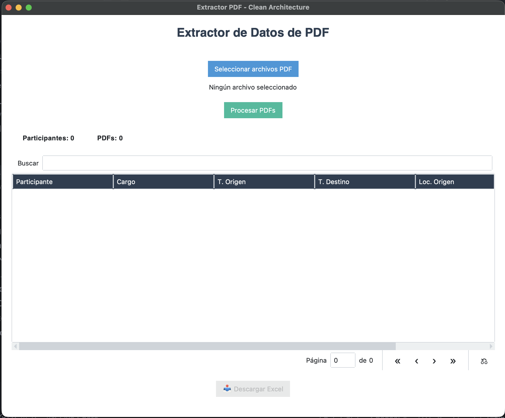
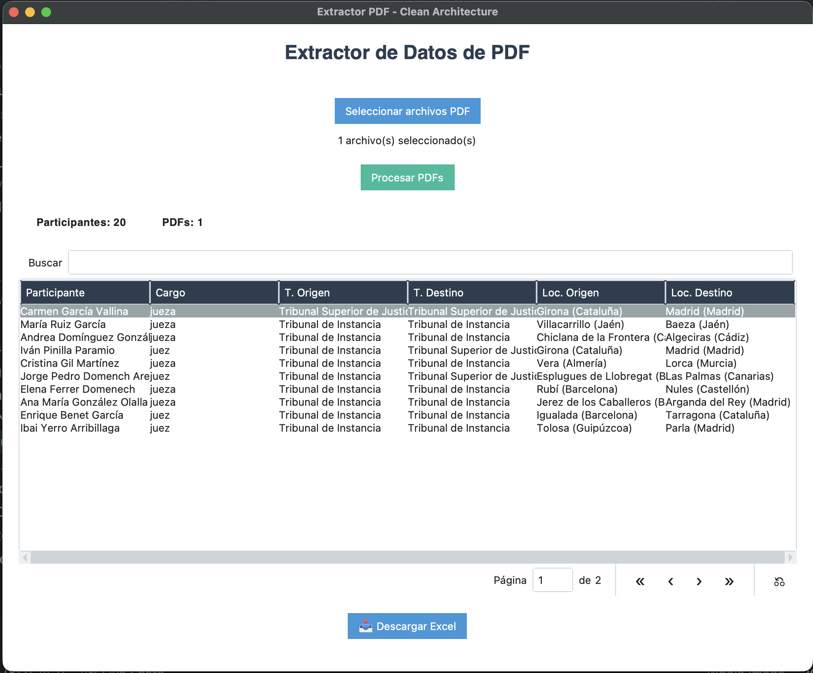

# 📄 BOE PDF Extractor


Aplicación de escritorio diseñada para automatizar la extracción de datos estructurados desde documentos PDF de resoluciones judiciales del **Boletín Oficial del Estado (BOE)**, exportando los resultados directamente a formatos tabulares (Excel).

## 🚀 Descarga y Uso (Usuarios Finales)

Para utilizar la aplicación **no necesitas instalar Python ni herramientas de desarrollo**.

1. Dirígete a la sección de **[Releases](../../releases)** (Lanzamientos) de este repositorio.
2. Descarga el archivo ejecutable correspondiente a tu sistema operativo (ej. `.exe` para Windows o `.dmg` / `.app` para macOS).
3. Abre la aplicación y selecciona el o los documentos PDF que deseas procesar.
4. Revisa los datos extraídos en la tabla de resultados.
5. Haz clic en "Exportar Excel" para generar tu archivo `.xlsx`.

---

## ✨ Características Principales

- **Procesamiento por Lotes**: Extrae información de múltiples PDFs simultáneamente.
- **Normalización de Territorios**: Resuelve automáticamente la provincia y la comunidad autónoma de España a partir de la localidad extraída.
- **Interfaz Gráfica Amigable (GUI)**: Desarrollada con `ttkbootstrap` para una experiencia de usuario moderna y sencilla.
- **Exportación Limpia**: Genera un archivo Excel con columnas y encabezados formateados, listo para su análisis.
- **Campos Extraídos**:
  - Participante / Solicitante
  - Cargo
  - Órgano Judicial de Origen
  - Órgano Judicial de Destino
  - Provincia / Localidad de Origen
  - Provincia / Localidad de Destino

---

## 📸 Interfaz de Usuario

*(Añade aquí un par de capturas de pantalla de tu aplicación para hacer el repositorio más profesional)*

```md


```

---

## 💻 Para Desarrolladores

Si deseas contribuir o ejecutar la aplicación desde el código fuente, la arquitectura está inspirada en los principios de **Clean Architecture**, separando claramente la lógica de negocio, los servicios de infraestructura y la capa de presentación.

### Requisitos Técnicos

- **Python 3.13+**
- Gestor de dependencias: `uv` (recomendado) o `pip`
- Soporte de GUI para Tkinter (en algunas distribuciones Linux requiere `sudo apt install python3-tk`)

### Instalación Rápida

**Opción 1: Usando `uv` (Recomendado)**
```bash
uv sync
uv run python main.py
```

**Opción 2: Usando entorno virtual tradicional (`venv`)**
```bash
python -m venv .venv
source .venv/bin/activate  # En Windows: .venv\Scripts\activate
pip install -e .
python main.py
```

### Estructura del Proyecto

```text
extractor-pdf/
├── main.py
├── pyproject.toml
├── uv.lock
└── src/
    ├── app/               # Casos de uso (Orquestación)
    ├── domain/            # Entidades, interfaces y constantes
    ├── infrastructure/    # Implementaciones concretas (PDF, Excel, JSON)
    └── presentation/      # Interfaz de usuario (GUI con ttkbootstrap)
```

## 📝 Notas
- Durante la primera ejecución, la aplicación podría descargar un dataset de territorios de España usado para resolver provincias y comunidades autónomas.
- La precisión de la extracción depende de la estructura y consistencia del PDF de origen, estando actualmente optimizada para un formato específico del BOE.

---

## 📄 Licencia

Este proyecto se distribuye bajo la licencia **MIT**.

## 👨‍💻 Autor

**Andres Gaibor**  
GitHub: [@AndresGaibor](https://github.com/AndresGaibor)
